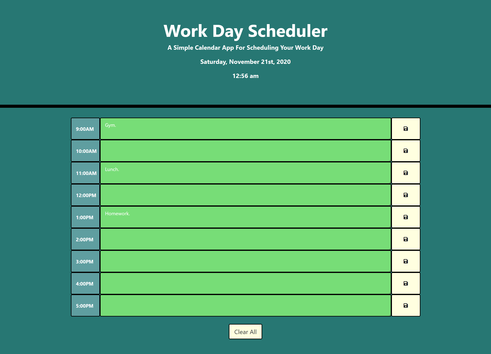

# Daily-Planner

## The Importance Of Using A Planner

    Do you find that there is never enough time for everything? If so, it is probably because you are not scheduling your time effectively. This happens when you just run constantly, going from one thing to the next, without really thinking about everything as a whole. Using a planner allows you to schedule each event, appointment, errand, and task, so that you know what to expect and don’t run out of time. Set specific due dates and deadlines for everything to help you stay on track.

## Description

    This week we were asked to create a simple calendar application that allows a user to save events for each hour of the day by modifying starter code. This app will run in the browser and feature dynamically updated HTML and CSS powered by jQuery.

## User Story

```
AS AN employee with a busy schedule
I WANT to add important events to a daily planner
SO THAT I can manage my time effectively
```

## Tasks Completed

    **List of Tasks Completed**

    1. Created index.html, script.js, and style.css files and linked together.

    2. Created time blocks for work hours from 9am to 5pm.

    3. Created clear all button at the bottom of the page to clear all user input.

    4. Created function to display time and date once page is loaded.

    5. Styled page through html and css to give it unique look and feel.

    6. Created function so that once user input is typed into the textarea and the save button is clicked it is saved to the local storage.

    7. Created function to indicate whether time is in the past present or future.

## Link to Deployed Application & ScreenShots of Completed Application

    **Live Link**
[Daily Planner](https://dspark8916.github.io/Daily-Planner/)

    **ScreenShots**





